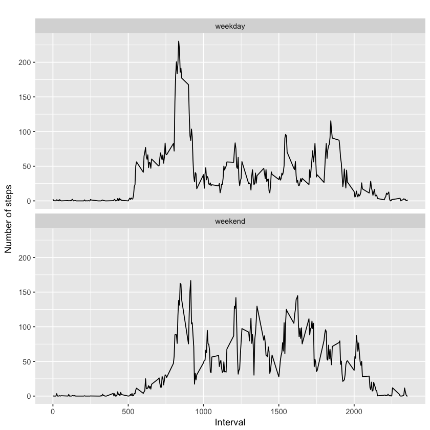

```R
library(knitr)
library(dplyr)
library(ggplot2)
```


```R
# load data
data_row <- read.csv('activity.csv')

# remove NA in data
data <- data_row[ with (data_row, { !(is.na(steps)) } ), ]

# print out first 20 rows
head(data)
```


<table>
<thead><tr><th></th><th scope=col>steps</th><th scope=col>date</th><th scope=col>interval</th></tr></thead>
<tbody>
	<tr><th scope=row>289</th><td>0         </td><td>2012-10-02</td><td> 0        </td></tr>
	<tr><th scope=row>290</th><td>0         </td><td>2012-10-02</td><td> 5        </td></tr>
	<tr><th scope=row>291</th><td>0         </td><td>2012-10-02</td><td>10        </td></tr>
	<tr><th scope=row>292</th><td>0         </td><td>2012-10-02</td><td>15        </td></tr>
	<tr><th scope=row>293</th><td>0         </td><td>2012-10-02</td><td>20        </td></tr>
	<tr><th scope=row>294</th><td>0         </td><td>2012-10-02</td><td>25        </td></tr>
</tbody>
</table>


```R
by_day <- group_by(data, date)
steps_by_day <- summarise(by_day, total = sum(steps))
head(steps_by_day)
```


<table>
<thead><tr><th scope=col>date</th><th scope=col>total</th></tr></thead>
<tbody>
	<tr><td>2012-10-02</td><td>  126     </td></tr>
	<tr><td>2012-10-03</td><td>11352     </td></tr>
	<tr><td>2012-10-04</td><td>12116     </td></tr>
	<tr><td>2012-10-05</td><td>13294     </td></tr>
	<tr><td>2012-10-06</td><td>15420     </td></tr>
	<tr><td>2012-10-07</td><td>11015     </td></tr>
</tbody>
</table>


```R
hist(steps_by_day$total, main="Histogram of total number of steps per day", 
     xlab="Total number of steps in a day")
```


```R
summary(steps_by_day)
```


             date        total      
     2012-10-02: 1   Min.   :   41  
     2012-10-03: 1   1st Qu.: 8841  
     2012-10-04: 1   Median :10765  
     2012-10-05: 1   Mean   :10766  
     2012-10-06: 1   3rd Qu.:13294  
     2012-10-07: 1   Max.   :21194  
     (Other)   :47                  


```R
# preprocessing data for plot
steps_by_interval <- aggregate(steps ~ interval, data, mean)

# create a time series plot 
plot(steps_by_interval$interval, steps_by_interval$steps, type='l', 
     main="Average number of steps over all days", xlab="Interval", 
     ylab="Average number of steps")
```


```R
# find row with max of steps
max_steps_row <- which.max(steps_by_interval$steps)

# find interval with this max
steps_by_interval[max_steps_row, ]
```


<table>
<thead><tr><th></th><th scope=col>interval</th><th scope=col>steps</th></tr></thead>
<tbody>
	<tr><th scope=row>104</th><td>835     </td><td>206.1698</td></tr>
</tbody>
</table>


```R
sum(is.na(data_row))
```


2304


```R
data_imputed <- data_row
for (i in 1:nrow(data_imputed)) {
  if (is.na(data_imputed$steps[i])) {
    interval_value <- data_imputed$interval[i]
    steps_value <- steps_by_interval[
      steps_by_interval$interval == interval_value,]
    data_imputed$steps[i] <- steps_value$steps
  }
}
```


```R
# calculate  total number of steps taken each day
df_imputed_steps_by_day <- aggregate(steps ~ date, data_imputed, sum)
head(df_imputed_steps_by_day)
```


<table>
<thead><tr><th scope=col>date</th><th scope=col>steps</th></tr></thead>
<tbody>
	<tr><td>2012-10-01</td><td>10766.19  </td></tr>
	<tr><td>2012-10-02</td><td>  126.00  </td></tr>
	<tr><td>2012-10-03</td><td>11352.00  </td></tr>
	<tr><td>2012-10-04</td><td>12116.00  </td></tr>
	<tr><td>2012-10-05</td><td>13294.00  </td></tr>
	<tr><td>2012-10-06</td><td>15420.00  </td></tr>
</tbody>
</table>


```R
hist(df_imputed_steps_by_day$steps, main="Histogram of total number of steps per day (imputed)", 
     xlab="Total number of steps in a day")
```


```R
# get mean and median of imputed data
mean(df_imputed_steps_by_day$steps)
```


10766.1886792453


```R
median(df_imputed_steps_by_day$steps)
```


10766.1886792453


```R
mean(steps_by_day$total)
```


10766.1886792453


```R
median(steps_by_day$total)
```


10765


```R
data_imputed['type_of_day'] <- weekdays(as.Date(data_imputed$date))
data_imputed$type_of_day[data_imputed$type_of_day  %in% c('Saturday','Sunday') ] <- "weekend"
data_imputed$type_of_day[data_imputed$type_of_day != "weekend"] <- "weekday"
```


```R
# convert type_of_day from character to factor
data_imputed$type_of_day <- as.factor(data_imputed$type_of_day)

# calculate average steps by interval across all days
df_imputed_steps_by_interval <- aggregate(steps ~ interval + type_of_day, data_imputed, mean)

# creat a plot
qplot(interval, 
      steps, 
      data = df_imputed_steps_by_interval, 
      type = 'l', 
      geom=c("line"),
      xlab = "Interval", 
      ylab = "Number of steps", 
      main = "") +
  facet_wrap(~ type_of_day, ncol = 1)
```

    Warning message:
    “Ignoring unknown parameters: type”





```R

```
